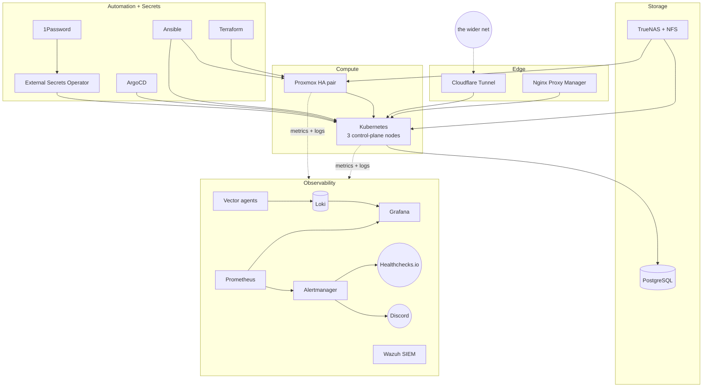

  

<h1 align="center">quasarlab-portfolio</h1>

  
  
  
  

  
  
  
  
  
  
  
  
  
  
  

A public showcase of the quasarlab homelab: infrastructure-as-code, GitOps,
observability, and the lessons learned while running it.

## About me

Infrastructure and platform engineer focused on identity and access,
infrastructure as code, CI/CD, and observability across hybrid cloud
environments. Based in the San Francisco Bay Area, between roles and
open to new work. Previously senior systems engineer at Uber, with
several Bay Area infrastructure roles before that. Certifications:
CCNA, MCITP, MCSE, VCP5-DCV.

This repo is the documentation half of my homelab, quasarlab. The code
that runs the lab lives in public sibling repositories (linked below);
what you see here is the architecture, the design decisions, and the
retrospectives tied together in one portfolio-shaped surface. I run the
lab the way I prefer to work: everything in code, one source of truth
per system, observability designed before the workload ships, and
post-incident writeups that are honest about what broke and why. Start
with Field reports and the lessons-learned section, that is where the
work actually happened.

On the side: open-source astronomy tooling contributions 🔭 (lsdb,
lightkurve, yt), Habitat for Humanity of Greater Miami volunteer since
2013, and a soft spot for themed alert routing (LOTR, Star Wars) because
a recognisable shape is easier to triage at 2am.

## Stack

| Layer         | Tools                                                                         |
|---------------|-------------------------------------------------------------------------------|
| Compute       | Proxmox (HA pair), Kubernetes (3 control-plane nodes, HAProxy/Keepalived VIP) |
| Storage       | TrueNAS, NFS, PostgreSQL                                                      |
| Observability | Prometheus, Alertmanager, Grafana, Loki + Vector, Wazuh (SIEM)                |
| GitOps        | ArgoCD, Helm rendered via Kustomize, values.yaml as source of truth           |
| Automation    | Ansible, Terraform                                                            |
| Secrets       | 1Password + External Secrets Operator                                         |
| Edge          | Cloudflare Tunnel, Nginx Proxy Manager                                        |

### How it fits together

> Logging was previously on the Elastic Stack. The lab moved to Loki +
> Vector + Wazuh; the reasoning is documented in
> [lessons-learned/elastic-to-loki-migration.md](lessons-learned/elastic-to-loki-migration.md).

## Field reports

A few stories worth reading first. Each is a filled-in retrospective,
not a placeholder. Status shields give you the headline at a glance:

- [Elastic to Loki + Vector + Wazuh migration](lessons-learned/elastic-to-loki-migration.md)
  
  Full log-platform swap. Parallel run, clean cutover, complete
  decommissioning. Freed tens of GBs of RAM and collapsed two panes
  of glass into one.
- [Proxmox HA fence, nine hours of silence](lessons-learned/pve-ha-outage.md)
  
  
  A real production-shape incident. HA fenced a node, VMs didn't come
  back, and the alert path was quietly broken. Four-day remediation
  across 21 merged PRs: boot-race fix, alert regex anchoring, 1Password
  rate-limit hardening, etcd defrag automation, Kubernetes upgrade, and
  an external dead-man's-switch.
- [Secrets as code on 1Password, and what the rate limit taught us](lessons-learned/secrets-iac-1password-eso.md)
  
  Defense-in-depth for a rate-limited secret backend: caching, kill
  switch, scoped service accounts, Prometheus quota observability,
  ESO circuit breaker, explicit rollout ordering. Includes the "the
  loud failure is not always the cause" bit.
- [Alertmanager single point of failure](lessons-learned/alertmanager-spof.md)
  
  A six-hour outage with zero alerts delivered. HA Alertmanager +
  PDB + external heartbeat. "I would notice" is not a monitoring
  strategy.
- [Grafana VM to Kubernetes migration](lessons-learned/grafana-k8s-migration.md)
  
  
  Moved state (SQLite to PostgreSQL via pgloader), moved workload
  (kube-prometheus-stack Helm), moved clients (MetalLB + NPM), and
  decommissioned the old VM by the full checklist.
- [Never rollout-restart *arr apps on NFS](lessons-learned/arr-rollout-restart.md)
  
  SQLite + NFS + rolling restart corrupts the database. The operating
  rule is scale-0-then-1. Short story, sharp takeaway.

## Dramatis personae 🗺️

The lab is many repos working in concert. Each has a distinct role.
Most are public and linkable. Two stay private on purpose (credentials,
disaster-recovery runbooks, TrueNAS state); this portfolio is the
curated narrative that ties them together.

- [**ansible-quasarlab**](https://github.com/mithr4ndir/ansible-quasarlab)
  the enchanter. Host config, inventory, and playbooks. Every Proxmox
  host, TrueNAS, and non-Kubernetes VM answers to it. Dynamic inventory
  from the Proxmox API, 1Password for credentials with a caching wrapper
  and kill switch in front.
- [**terraform-quasarlab**](https://github.com/mithr4ndir/terraform-quasarlab)
  the architect. Lays the groundwork in VMs, Proxmox resources, and
  Cloudflare records. 1Password provider for sensitive variables; no
  `*.tfvars` in git.
- [**k8s-argocd**](https://github.com/mithr4ndir/k8s-argocd) the city.
  ArgoCD app-of-apps, every workload manifest, the place where services
  actually live. Helm charts rendered through Kustomize with
  `values.yaml` as the source of truth.
- [**observability-quasarlab**](https://github.com/mithr4ndir/observability-quasarlab)
  the watchtower. Grafana dashboards, Prometheus rules, Loki config, log
  pipelines as code. Alerts leave here and arrive in Discord themed by
  severity and flavor.
- **truenas-config-backup** (private) the librarian. Scheduled
  TrueNAS config snapshots so a failed upgrade is recoverable.
- **quasarlab-disaster-recovery** (private) the war room. Procedures
  for the bad day you hope never comes.

## Repository map

- [architecture/](architecture/) high-level diagrams and design notes
- [docs/](docs/) per-domain deep dives (kubernetes, observability, storage,
  media stack, astronomy, security)
- [lessons-learned/](lessons-learned/) post-incident writeups and design
  retrospectives
- [dashboards/](dashboards/) curated Grafana dashboards and screenshots
- [alerts/](alerts/) Alertmanager routing, Prometheus rules, Discord patterns
- [automation/](automation/) notes on the Ansible, Terraform, and Kubernetes
  toolchains
- [screenshots/](screenshots/) static evidence for the portfolio

## Live showcase

TODO. A read-only public Grafana instance will be published behind a
Cloudflare Tunnel. The design lives in
[docs/security/public-showcase.md](docs/security/public-showcase.md).

## Open-source contributions

Work on astronomy and data tooling that came out of this lab:

- [lsdb#1325](https://github.com/astronomy-commons/lsdb/pull/1325) Kubernetes
  deployment documentation
- [lightkurve#1553](https://github.com/lightkurve/lightkurve/pull/1553) CI
  improvements
- [yt#4391](https://github.com/yt-project/yt/pull/4391) documentation CI
  workflow

## Contact

- GitHub: [@mithr4ndir](https://github.com/mithr4ndir)
- LinkedIn: [chris-ladino-93654254](https://www.linkedin.com/in/chris-ladino-93654254/)

## License

MIT. See [LICENSE](LICENSE). The hero image under `assets/` was generated
with an AI image tool for banner use and is included under the same
license.
