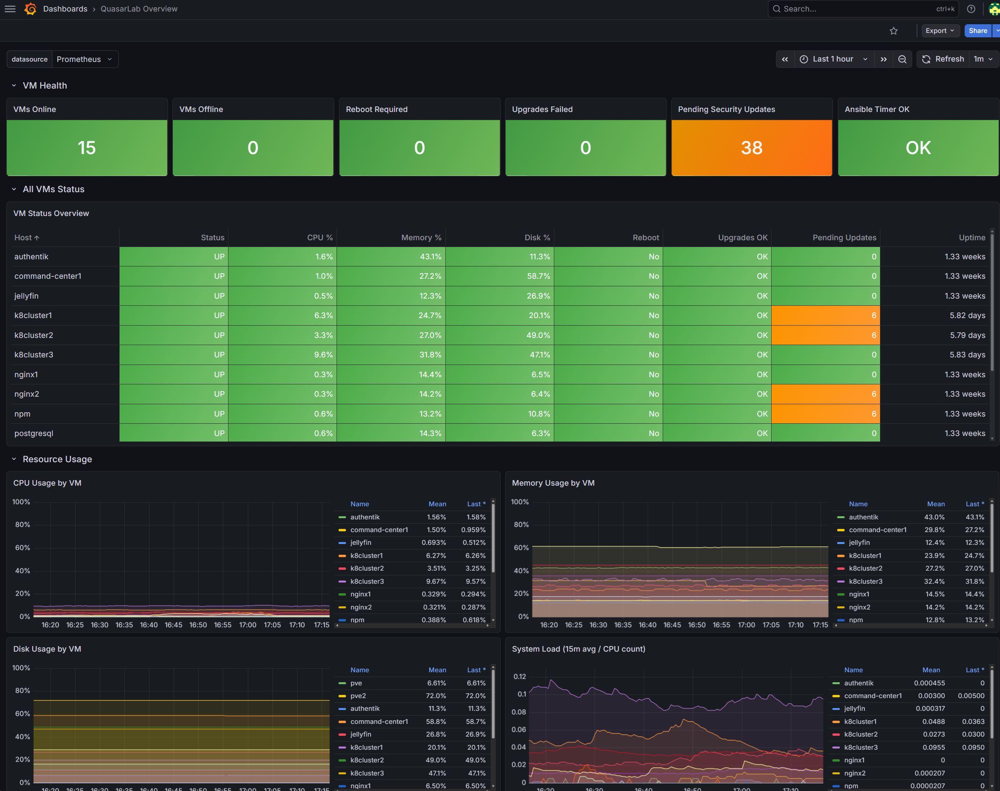
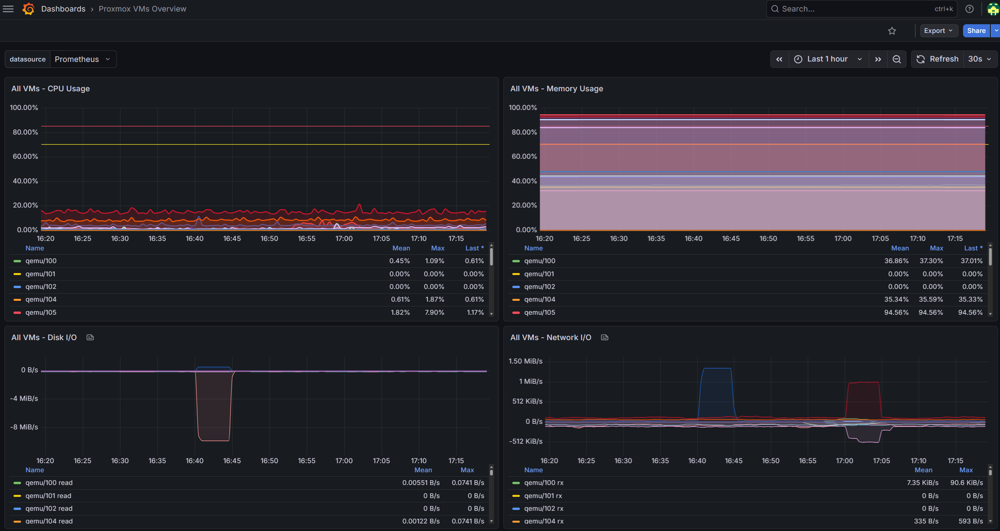
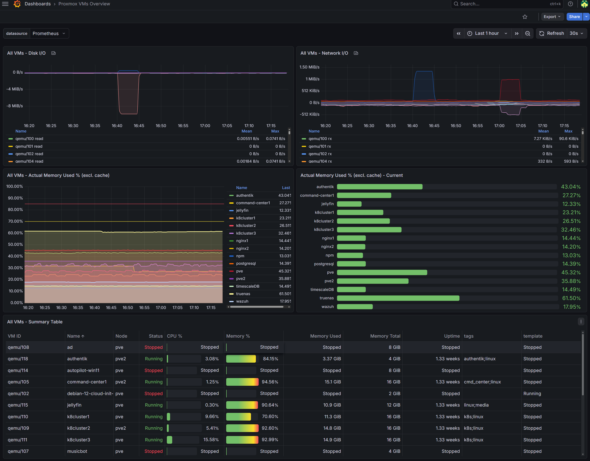
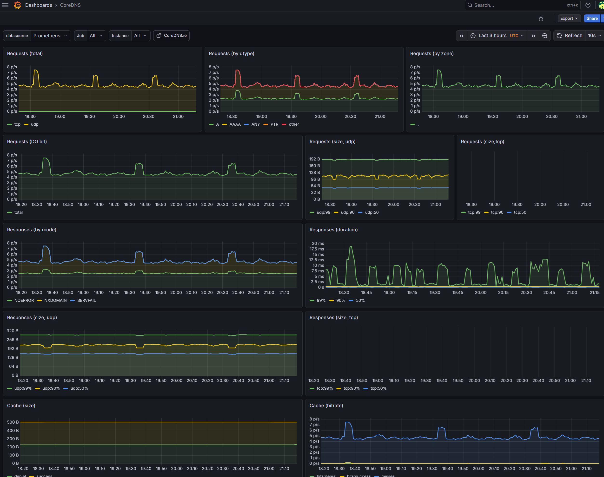
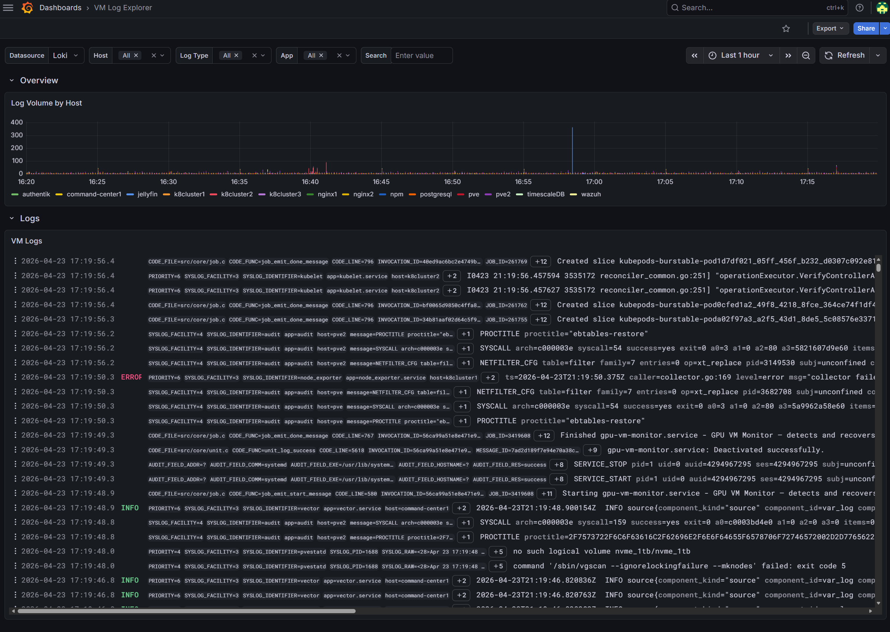
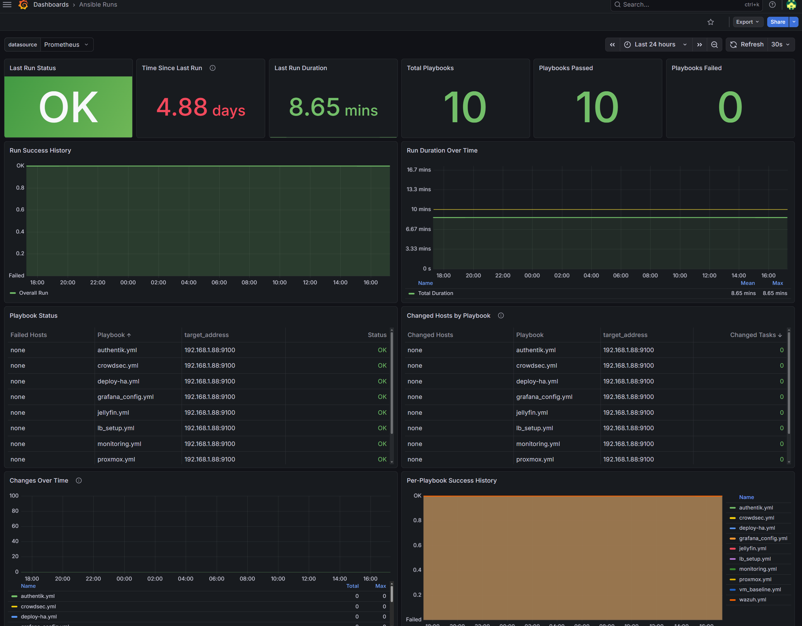
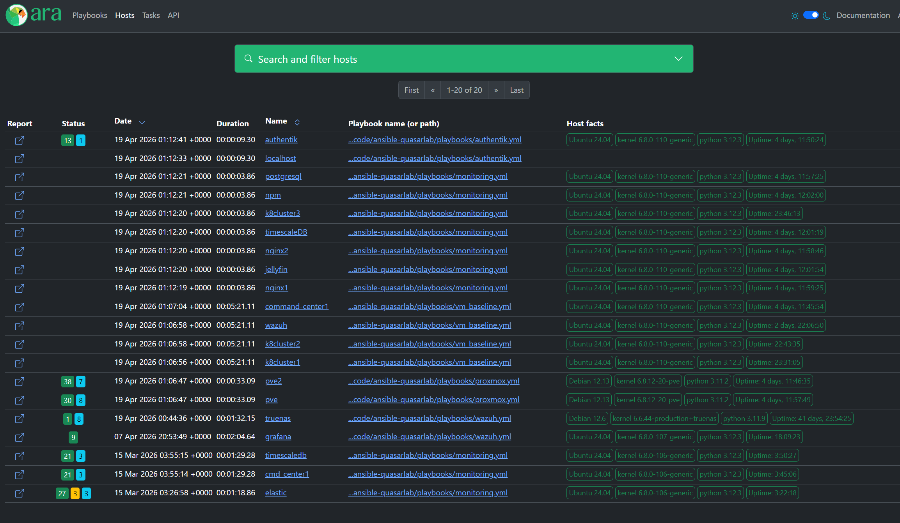

# Screenshots

A short visual tour of the lab. Captures come from the live Grafana
and ARA instances.

## Tour

### QuasarLab overview

Top-level lab health: VMs online, pending reboots, failed upgrades,
security update counters, and the "Ansible Timer OK" tile. The status
table underneath lists every VM with CPU, memory, disk, reboot state,
and uptime. This is the first dashboard I open in the morning.

### Proxmox VM resources

Per-VM CPU, memory, disk I/O, and network throughput at a glance.
Useful for catching an outlier before it starts affecting neighbours.

### Proxmox VM detail

The deeper cut: disk and network I/O timelines, actual memory used
per VM (both timeline and current bar chart), and a full summary
table with VMID, mode, status, tags, and uptime. If the overview
says something is off, this is where I look next.

### Kubernetes CoreDNS

Cluster DNS health: request rate, query-type breakdown, response
codes, duration percentiles, and cache hit ratio. A quiet CoreDNS
dashboard is an underrated signal that the cluster is behaving.

### Loki log explorer

The Loki-backed log explorer. Top: log volume per host so I can
see which VM is chatty at a glance. Bottom: live log stream with
host/log-type/app filters. Label extraction happens at the Vector
edge so filters are fast and consistent. See
[lessons-learned/elastic-to-loki-migration.md](../lessons-learned/elastic-to-loki-migration.md)
for why the stack looks the way it does.

### Ansible Runs dashboard (Prometheus-sourced)

A Grafana dashboard fed by textfile-collector metrics emitted from
each Ansible run. Last-run status, duration, total playbooks
executed, playbook-level pass/fail history, and per-playbook
success timeline. Treats Ansible runs as a first-class observable
rather than fire-and-forget.

### ARA, Ansible Run Analysis

ARA is the "what actually happened" layer on top of Ansible. Every
playbook run lands here with per-task status, host facts, and
output, so post-mortems on a failed run do not require digging
through terminal history.

## Capture conventions

- Screenshots come from the live lab. Internal hostnames and RFC1918
  IPs are visible where Grafana shows them; that is intentional for
  a homelab portfolio.
- PNGs only. File sizes are kept sensible; the pre-commit
  `check-added-large-files` hook caps at 4096 KB.
- When recapturing, prefer Grafana's built-in "share panel" PNG
  export over OS-level screenshots so the crop stays consistent.
